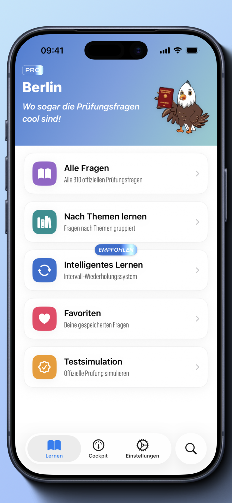
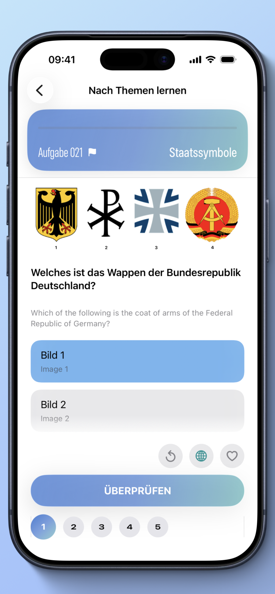
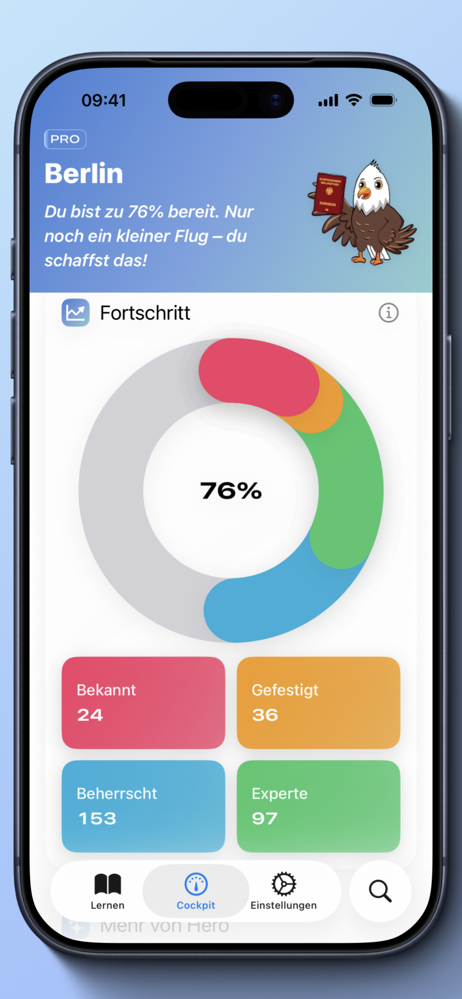
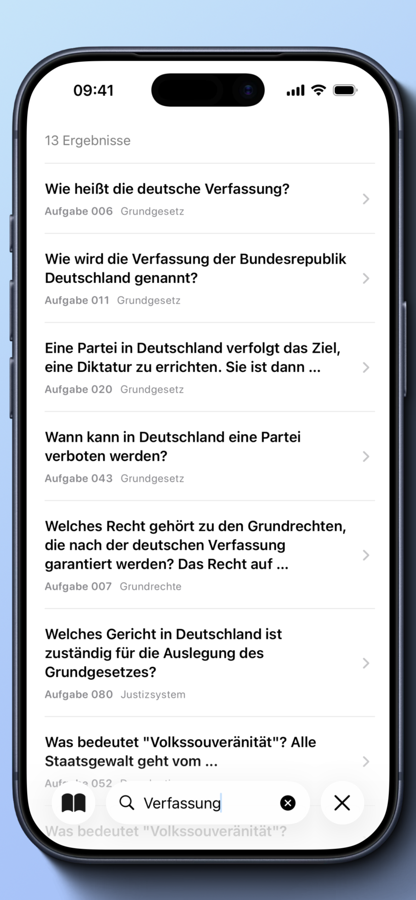

# Hero: Einbürgerungstest 2026

---

## Deutsch

Native **iOS-App** zur Vorbereitung auf den **Leben-in-Deutschland-** / **Einbürgerungstest**.

Übe mit dem offiziellen Fragenkatalog, verfolge deinen Lernstand und simuliere die echte Prüfung.

### Funktionen

- **Smart Learning** — Lernen mit Wiederholungen in Abständen
- **Nach Themen lernen** — Fragen nach Kategorien
- **Prüfungssimulation** — 33 Fragen, 60 Minuten
- **Favoriten & Suche**
- **Cockpit** — Fortschritt für dein Bundesland
- **Mehrsprachig** — DE, EN, RU, TR

### Technik

- **iOS 18+** · **Xcode** · **Swift** · **SwiftUI**
- Strukturierter Code: **Screens**, **ViewModels**, **Services**
- Fragen und Inhalte als **JSON**; Fortschritt mit **SwiftData** + **CloudKit (iCloud)** — optional auf Apple-Geräten synchronisiert, pro Bundesland getrennt
- **Datengetriebene Auswertung:** Lernstatistiken, Prüfungsbereitschaft, Fortschritt pro Frage
- **Adaptive Lernplanung** (**Spaced Repetition**) auf Basis der Antwort-Historie
- **Python**-Skripte zur Pflege der **JSON**-Fragenkataloge
- **Lokalisierung** (DE, EN, RU, TR)
- **RevenueCat** / **App Store** — Abonnements

### Links

- [App Store](https://apps.apple.com/app/id6752272685)
- [Website — App-Seite](https://www.gizatech.de/hero-einb%C3%BCrgerungstest)
- [Datenschutz](https://www.gizatech.de/hero-einb%C3%BCrgerungstest/privacy-policy)

Quellcode dieses Repositories; aktiv in Entwicklung (`develop`).

---

## English

Native **iOS** app to prepare for the German **Leben in Deutschland** / **Einbürgerungstest** (citizenship test).

Practice with the official question catalog, track your progress, and simulate the real exam.

### Features

- **Smart Learning** — spaced repetition
- **Learn by Topics** — questions by category
- **Test Simulation** — 33 questions, 60 minutes
- **Favorites & Search**
- **Cockpit** — progress for your federal state
- **Multilingual** — DE, EN, RU, TR

### Tech

- **iOS 18+** · **Xcode** · **Swift** · **SwiftUI**
- Structured code: **screens**, **view models**, **services**
- **JSON** content; progress via **SwiftData** + **CloudKit (iCloud)** — syncs across Apple devices when signed in; separate dataset per federal state
- **Data-driven analytics:** per-question stats, readiness score, progress dashboards
- **Adaptive review scheduling** (**spaced repetition**) from answer history
- **Python** scripts for maintaining the **JSON** question catalogs
- **Localization** (DE, EN, RU, TR)
- **RevenueCat** / **App Store** — subscriptions

### Links

- [App Store](https://apps.apple.com/app/id6752272685)
- [Website — app page](https://www.gizatech.de/hero-einb%C3%BCrgerungstest)
- [Privacy policy](https://www.gizatech.de/hero-einb%C3%BCrgerungstest/privacy-policy)

Source code for this app; actively developed (`develop` branch).

---

## Screenshots

| Home | Learn by topics |
|:---:|:---:|
|  |  |

| Progress (Cockpit) | Search |
|:---:|:---:|
|  |  |

---

## Author / Autor

Ildar Gizatullin
